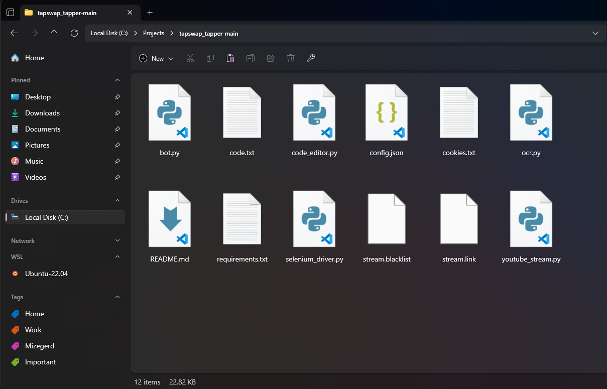

# ⚙️ tapswap_tapper (تپ سواپ کلیکر)

A bot for auto-clicking and bypassing stream codes using Selenium and OCR.  
ربات برای کلیک خودکار و دور زدن کدهای استریم با استفاده از Selenium و OCR.

---

  
*Banner for tapswap_tapper*

---

## English

### Project Title
**tapswap_tapper**  
A powerful automation bot designed to click on streams and bypass codes with ease, utilizing Selenium for browser automation, Tesseract OCR for text recognition, and ffmpeg for media processing.

### Table of Contents
1. [Install & Run](#install--run)
2. [Features](#features)
3. [Contributing](#contributing)
4. [License](#license)

### Install & Run

#### Prerequisites
1. Install **Python 3**.
2. Install required libraries from `requirements.txt`.
3. Install **Google Chrome** and set up the **Selenium driver**.
4. Install **tesseract-ocr**.
5. Install **ffmpeg**.

#### Steps

1. **Install Python 3**  
   Ensure that Python 3 is installed on your system. You can download it from [Python Downloads](https://www.python.org/downloads/).

2. **Install Required Libraries**  
   Navigate to the project directory and run the following command to install the required Python libraries:
   ```bash
   pip3 install -r requirements.txt
   ```

3. **Install tesseract & ffmpeg on Debian (Ubuntu)**
   ```bash
   sudo apt-get update
   sudo apt-get install tesseract-ocr
   sudo apt-get install ffmpeg
   ```

4. **Edit the Configuration File**  
   Modify the `config.json` file with necessary parameters like bot token and API keys:
   ```json
   {
      "url": "",
      "limit": 7000,
      "multitap_level": 9,
      "bot_token": "YOUR_BOT_TOKEN",
      "chat_id": YOUR_CHAT_ID,
      "ocr_api_key": "YOUR_OCR_API_KEY"
   }
   ```

5. **Set Up Chrome Driver**  
   Download and set up the **Chrome driver** compatible with your browser version. Place it in the project directory.

6. **YouTube Login Setup**  
   Add YouTube account login cookies to the `cookies.txt` file to allow the bot to bypass login.

7. **Run the Bot**  
   Start the bot by running:
   ```bash
   python3 bot.py
   ```

### Features
- 🔄 **Auto-clicking**: Automatically clicks through streams, saving time and effort.
- 📸 **OCR Integration**: Uses Tesseract OCR for text recognition to bypass code verifications.
- 🔄 **Selenium Automation**: Controls Chrome to automate YouTube interactions and bypass streams.
- ⚙️ **Easy Configuration**: Customizable settings through `config.json`, including API keys and multitap levels.
- 🔒 **Cookie-based Authentication**: Uses stored YouTube login cookies for seamless login.

---

## فارسی (Persian)

### عنوان پروژه
**تپسواپ تپر**  
یک ربات قدرتمند برای کلیک خودکار در استریم‌ها و دور زدن کدهای تایید با استفاده از Selenium و OCR.

---

  
*بنر برای tapswap_tapper*

---

### فهرست مطالب
1. [نصب و اجرا](#نصب-و-اجرا)
2. [ویژگی‌ها](#ویژگی‌ها)
3. [مشارکت](#مشارکت)
4. [مجوز](#مجوز)

### نصب و اجرا

#### پیش‌نیازها
1. نصب **پایتون ۳**.
2. نصب کتابخانه‌های مورد نیاز از `requirements.txt`.
3. نصب **Google Chrome** و تنظیم **Selenium driver**.
4. نصب **tesseract-ocr**.
5. نصب **ffmpeg**.

#### مراحل

1. **نصب پایتون ۳**  
   مطمئن شوید که پایتون ۳ روی سیستم شما نصب شده است. می‌توانید آن را از [Python Downloads](https://www.python.org/downloads/) دانلود کنید.

2. **نصب کتابخانه‌ها**  
   به دایرکتوری پروژه بروید و کتابخانه‌های مورد نیاز را نصب کنید:
   ```bash
   pip3 install -r requirements.txt
   ```

3. **نصب tesseract و ffmpeg در Debian (اوبونتو)**
   ```bash
   sudo apt-get update
   sudo apt-get install tesseract-ocr
   sudo apt-get install ffmpeg
   ```

4. **ویرایش فایل پیکربندی**  
   فایل `config.json` را با پارامترهای لازم مثل توکن ربات و کلیدهای API ویرایش کنید:
   ```json
   {
      "url": "",
      "limit": 7000,
      "multitap_level": 9,
      "bot_token": "توکن_ربات_شما",
      "chat_id": شناسه_چت_شما,
      "ocr_api_key": "کلید_API_OCR_شما"
   }
   ```

5. **تنظیم درایور کروم**  
   درایور **کروم** را مطابق با نسخه مرورگر خود دانلود کرده و در دایرکتوری پروژه قرار دهید.

6. **راه‌اندازی ورود به یوتیوب**  
   کوکی‌های ورود حساب یوتیوب خود را در فایل `cookies.txt` قرار دهید تا ربات بتواند بدون ورود مجدد عمل کند.

7. **اجرای ربات**  
   برای اجرای ربات دستور زیر را اجرا کنید:
   ```bash
   python3 bot.py
   ```

### ویژگی‌ها
- 🔄 **کلیک خودکار**: به صورت خودکار استریم‌ها را کلیک می‌کند و در زمان و تلاش صرفه‌جویی می‌کند.
- 📸 **یکپارچه‌سازی OCR**: از Tesseract برای شناسایی متن استفاده می‌کند تا کدهای تایید را دور بزند.
- 🔄 **اتوماسیون Selenium**: با استفاده از کروم برای تعاملات خودکار یوتیوب و دور زدن استریم‌ها.
- ⚙️ **پیکربندی آسان**: تنظیمات قابل سفارشی‌سازی از طریق `config.json` شامل کلیدهای API و سطوح چندکلیک.
- 🔒 **احراز هویت بر اساس کوکی**: از کوکی‌های ورود یوتیوب برای ورود بدون نیاز به تکرار استفاده می‌کند.

---

### Contributing (مشارکت)
1. Fork the repository.  
   ریپوزیتوری را فورک کنید.
   
2. Create a new branch: `git checkout -b feature-branch`.  
   یک شاخه جدید بسازید: `git checkout -b feature-branch`.
   
3. Make your changes and commit: `git commit -m 'Add new feature'`.  
   تغییرات خود را اعمال کنید و کامیت بزنید: `git commit -m 'افزودن ویژگی جدید'`.
   
4. Push to the branch: `git push origin feature-branch`.  
   به شاخه مربوطه پوش کنید: `git push origin feature-branch`.
   
5. Submit a pull request.  
   درخواست Pull Request ارسال کنید.

---

### License (مجوز)
This project is licensed under the MIT License.  
این پروژه تحت مجوز MIT ارائه شده است.

